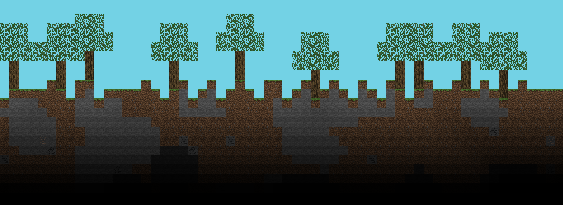

# Minimc
- - - - -


Minimc is a playable **MMO minecraft** 'clone' in Discord.
<br>You can **generate unique worlds**, **invite your friends** to them and play together.

The game features various logic like handling **physics**, **tick rate**, **collisions**, **block states** and even really good looking **2D Lighting calculations**.
<br>This new version includes **image generation** which eliminated certain limitations I ran into previously. (Old version used a conversion from data to emojis for rendering the world)
- - - - -
## How to contribute
Modify the [your.env](.env) with your required credentials. 

Rename `your.env` to `.env`

Create your database (example: [MySQL](https://www.mysql.com/de/)) with the correct name from [.env](.env)

Depending on your [DBMS](https://www.ibm.com/docs/en/zos-basic-skills?topic=zos-what-is-database-management-system) you maybe have to modify the [database.py](database.py) due to different connectors.

MySQL
```py
 engine = create_engine(f"mysql+mysqlconnector://{user}:{pwd}@{host}/{database}")
 ```

MariaDB
```py
 engine = create_engine(f"mysql+pymysql://{user}:{pwd}@{host}/{database}")
 ```

Install the required libraries from [requirements.txt](requirements.txt) using [pip](https://pypi.org/project/pip/) 

```
pip install -r requirements.txt
```
🎉 You should now be able to generate a world with the slash command `/generate`
- - - - -
### Feature list
- 🏃‍♂️ Player movement & rendering
- 👊 Placing / Destroying `blocks`
- 🍎 Physics affecting `blocks` and `entities` (sand, gravel, player gravity)
- ✨ Collision detection
- 🏠 Structure generation ( Able to create your own presets and spawn them in, see [tree.py](tree.py) )
- 🌎 World generation including ores, caves
- 🎮 Multiplayer synced movement, servers wtih invite functionality
- 💡 2D calculated lighting
- 🧱 `Block` states with different rendering depending on the state
- 🔓 Z-Axis so `blocks` can be rendered in the background/foreground
- - - - -
### Ideas
- Redstone
- AI `entities` ( chicken, cow, zombie, . . )
- Dimensions
- Health & fall damage
- PVP