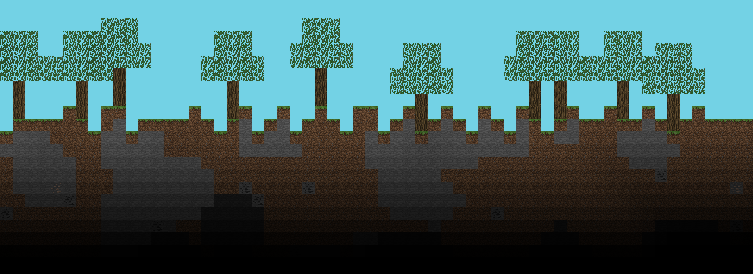
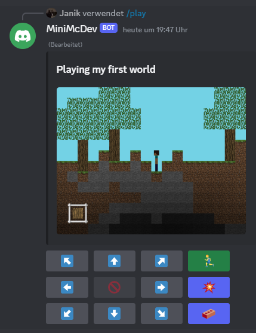

# Minimc - 2D Playble Minecraft in Discord
- - - - -


> [!IMPORTANT]
> The bot is running on my server right now, expect it to go down sometimes. Otherwise host it yourself.
>
> Invite the bot [here](https://discord.com/oauth2/authorize?client_id=1098581527446700083&permissions=2147871745&scope=bot)


Minimc is a playable **MMO minecraft** 'clone' in Discord.
<br>You can **generate unique worlds**, **invite your friends** to them and play together.

The game features various logic like handling **physics**, **tick rate**, **collisions**, **block states** and even really good looking **2D Lighting calculations**.
<br>This new version includes **image generation** which eliminated certain limitations I ran into previously. (Old version used a conversion from data to emojis for rendering the world)



- - - - -
## How to contribute
Create a fork of this repository

Create a [Discord Bot](https://discord.com/developers/docs/intro). You can do this [here](https://discord.com/developers/applications).<br>
You'll need it to test your code changes by inviting your bot to your own discord server ( or private chat )

Create a `.env` file, it should look like [your.env](your.env) but replace the variables with your credentials

Create your database (example: [MySQL](https://www.mysql.com/de/)) with the correct name from [.env](.env)

You don't have to worry about any tables & data entries because [SQLAlchemy](https://www.sqlalchemy.org/) is taking care of that process

Depending on your [DBMS](https://www.ibm.com/docs/en/zos-basic-skills?topic=zos-what-is-database-management-system) you maybe have to modify the [database.py](database.py) due to different connectors.

MySQL
```py
 engine = create_engine(f"mysql+mysqlconnector://{user}:{pwd}@{host}/{database}")
 ```

MariaDB
```py
 engine = create_engine(f"mysql+pymysql://{user}:{pwd}@{host}/{database}")
 ```

Install the required libraries from [requirements.txt](requirements.txt) using [pip](https://pypi.org/project/pip/) 

```
pip install -r requirements.txt
```
🎉 You should now be able to generate a world with the slash command `/generate`
- - - - -
### Documentation

<b>Is there a good way to test world generation quickly?</b> 

You can easily test the **world generation** by executing the file [test_render_world_generation.py](test_render_world_generation.py). It'll automatically generate a brand new world and store a **full rendering** of that world in a specific output folder.

<b>Can I get a render of all available worlds? (useful in production)</b>

You can easily get a snapshots of all available worlds by executing the file [test_render_all_worlds.py](test_render_all_worlds.py).

*more coming soon*
- - - - -
### Feature list
- 🏃‍♂️ Player movement & rendering
- 👊 Placing / Destroying `blocks`
- 🍎 Physics affecting `blocks` and `entities` (sand, gravel, player gravity)
- ✨ Collision detection
- 🏠 `Structure` generation ( Able to create your own presets and spawn them in, see [tree.py](tree.py) )
- 🌎 `World` generation including ores, caves
- 🎮 Multiplayer synced movement & states, worlds with invite functionality
- 💡 2D calculated lighting
- 🧱 `Block` states with different rendering depending on the state
- 🔓 Z-Axis so `blocks` can be rendered in the background/foreground
- 🐌 Using Threading for the world generation process
- - - - -
### Ideas
- Redstone
- AI entities ( chicken, cow, zombie, . . )
- Dimensions
- Biomes
- Health & fall damage
- PVP
- Public worlds with server browser ( limited amount of course )
- Dynamic block states based on more logic ( example: Torch sprite based on adjacent blocks )
- Block functionality ( TNT that destroys blocks in a radius uppon interacting )
- Water/Lava simulation
